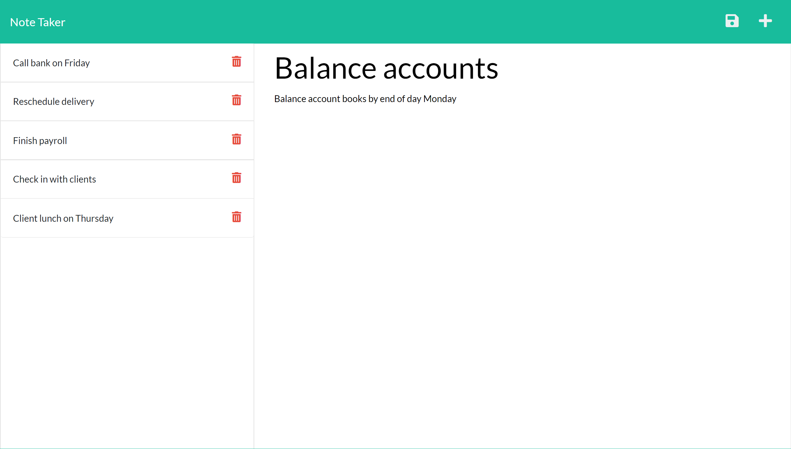

# Express.js: Note Taker

## Description

The project allows the user to write and save notes.

## ScreenShot

## Table of Contents

- [Installation](#installation)
- [Usage](#usage)
- [License](#license)
- [Contributing](#contributing)
- [Tests](#tests)
- [Questions](#questions)

## Installation

To install dependecies in the terminal use npm install

## Usage

To run the application use node server.js or npm start

## License

Licensed under the <a href="./LICENSE.txt">MIT License</a>

## Contributing

This project follows the Fork and Pull Git workflow guidlines

## Tests

There are no test instructions

## Questions

GitHub Profile: <a href="https://github.com/acromarti01">https://github.com/acromarti01</a>

Any additional question you can reach me at <u>acromarti@gmail.com</u>

## Link to Deployed Website

